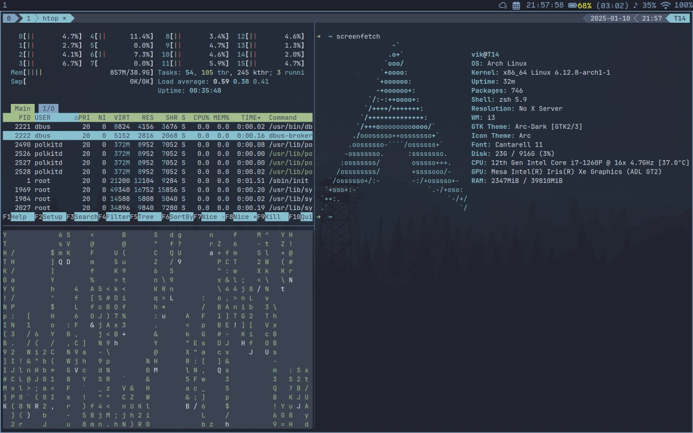

#### Установка зависимостей и нужных мне пакетов в момент установки системы

```
openssh python dhclient iwd iw vim nano bash-completion zsh xorg-xinit xorg-xrandr base-devel git net-tools dnsutils netkit-telnet curl
```

#### Установка i3, Xorg и драйверы

T14

```
pacman -S sof-firmware
```

`sof-firmware` - Драйвер для звука

Устанавливаем yay

```
sudo pacman -S --needed git base-devel
git clone https://aur.archlinux.org/yay.git
cd yay
makepkg -si
```


```
yay -S xss-lock ttf-comic-shanns-nerd ttf-jetbrains-mono-nerd maim xclip thunar gvfs gvfs-smb smbclient lxappearance arc-gtk-theme arc-icon-theme capitaine-cursors zenity ranger tmux vim xorg-xrandr arandr xorg-xinput picom dnust alacritty xclip
```

Через `lxappearance` устанавливаем темы:

```
arc-gtk-theme
arc-icon-theme
capitaine-cursors
```

Их мы установили в предыдущем шаге

#### bluethooth

```
sudo pacman -S bluez-cups blues-hid2hci bluez-libs bluez-mesh bluez-obex bluez-qt bluez-tools bluez-utis blueman
```

`/etc/bluetooth/main.conf`

Если вы хотите, чтобы адаптер не включался автоматически. Эту настройку не применял
```
[Policy]
AutoEnable=false
```

```
sudo systemctl enable bluetooth.service
sudo systemctl start bluetooth.service
```
#### i3block

Готовые блоки брал от сюда: https://github.com/vivien/i3blocks-contrib

[Wi-Fi](https://github.com/vivien/i3blocks-contrib/tree/master/wifi)
[Звук](https://github.com/vivien/i3blocks-contrib/tree/master/volume)
[Батарея](https://github.com/vivien/i3blocks-contrib/tree/master/battery2)
[Календарь](https://github.com/vivien/i3blocks-contrib/tree/master/calendar)

Зависимости для блоков
```
sudo pacman -S yad xdotool acpi iw
```

Так же я написал свой маленький блок, который по клику будет мне открывать Web UI программы Sycnthing

```
[syncthing]
command=firefox --new-tab http://127.0.0.1:8384
full_text=󱋖
```

> Конфиг лежит в репозитории

Понятное дело, что нужно еще сохранить себе скрипты в папку `~/.config/i3/scripts/`. Файлы тоже лежат в репе

Всем этим скриптам надо дать права на исполнение

```
chmod +x ~/.config/i3/scripts/*
```

Папку со скриптами можно хранить в любом удобном месте

#### Picom

Добавим конфиг picom, который позволит избавиться от тиринга и немного преобразит внешний вид i3

Положим файл в `~/.config/i3/picom.conf`, который есть в репе и в конфиге i3 он подключен

#### xlock (экран блокировки)

В моих .dotfiles есть папка `~/.config/img` в которой будут находится картинки для работчего стола, для экрана блокировки. Эти картинки так же использует i3lock - софт который вызывает блокировку экрана

Чтобы заблокированных экран кастмизировать, нужно для этого написать небольшой скрипт `~/.config/i3/scripts/i3exit.sh`

С помощью этого скрипта можно сделать i3block для блокировки/разлогинивания и т.д.
Или же забиндить хоткеи. У меня стоит хоткей на блокировку

#### Dunst (push-уведомления)

Данный софт позволяет отображать на рабочем пространстве push-уведомления. То есть например Telegram использует свои самописные пуши, а другой софт может использовать системные вызовы (что-то вроде API)

Запишем файл настроек `~/.config/dnust/dunstrc`

Далее мы будем запускать dnust через конфигурацию i3

#### i3 config

Ну и перейдем к настройке самого i3. Перезапишем файл `~/.config/i3/config`

Подробно не буду рассказывать про конфиг, для этого есть хорошая [документация](https://i3wm.org/docs/)

#### GRUB2

```
/etc/default/grub
```

```
GRUB_BACKGROUND="/path/to/wallpaper"
GRUB_THEME="/path/to/gfxtheme"
```

Передаем путь до картинки. ВАЖНО! Если у тебя диск зашифрован, то картинку нужно положить в директорию `/boot`

```
grub-mkconfig -o /boot/grub/grub.cfg
```

#### Alacrityy

Я использую эмулятор терминала Alacritty. Который настроен под тему Arc или Nord (как по мне разницы почти никакой)

Создадим файл или отредактируем конфиг `~/.config/alacritty/alacritty.toml`


Сейчас очень много примеров настроек Alacritty в формате yml, но YML-формат считается устаревшим для Alacritty. По этому я использую уже актуальный формат TOML

Если у тебя есть хороший YML конфиг, но не хочется его переписывать руками. Положи YML-файл в папку конфигурации и можно выполнить `alacritty migrate`. 
Затем YML-файл можно будет удалить

#### TMUX & VIM

Остается немного. Я люблю использовать tmux + vim для работы. Сейчас настроим каждый из них

`~/.cofig/tmux/tmux.conf`

Затем выключаем все сессии tmux и запускаем его снова. После включения нажимаем клавишу `prefix+I`

Будут установлены все плагины и можно будет полноценно пользоваться tmux.

Так же есть более быстрая установка

```
curl --create-dirs -fLo \
    ~/.config/tmux/tmux.conf \
    https://raw.githubusercontent.com/r4ven-me/dots/main/.config/tmux/tmux.conf
```

Теперь настроим vim `~/.vimrc`

Включаем vim и выполняем `:PluginInstall`. После установки плагинов рекомендую перезапустить vim. Настройки хоткеев, тоже не вижу большого смысла расписывать.

Единственное, где я добавил свои хоткеи, это `F2`, для вызова файлового менеджера

Настройка на самой последней строке
```
map <F2> :NERDTreeToggle<CR>
```

#### ZSH

Установим [Oh My Zsh](https://ohmyz.sh/#install)

```
sh -c "$(curl -fsSL https://raw.githubusercontent.com/ohmyzsh/ohmyzsh/master/tools/install.sh)"
```
#### Мелочи по настройке

У меня i3 выглядит довольно мелко, хотелось бы увеличить масштаб. Это можно сделать в файле `~/.Xresources`

```
Xft.dpi: 120
```

Если файла, нет, создаем его. Эта настройка увеличит а 20% скейл экрана.

Для некоторых других приложений может потребоваться выполнить еще такую настойку

```
# Other apps (Chrome, Nautilus, Terminal...)
echo "export GDK_DPI_SCALE=1.25" >> ~/.profile
```

Так же займемся переключением раскладки.

`/etc/X11/xorg.conf.d/00-keyboard.conf` - в файле настойки клавиатуры приведем ее к виду 

```
Section "InputClass"
        Identifier "system-keyboard"
        MatchIsKeyboard "on"
        Option "XkbLayout" "us,ru"
        Option "XkbModel" "pc105+inet"
        Option "XkbOptions" "grp:caps_toggle"
EndSection
```

Главные опции тут 

```
...
Option "XkbLayout" "us,ru"
Option "XkbOptions" "grp:caps_toggle"
...
```

То есть добавление RU раскладки и переключение на CapsLock. С переключением раскладок бывает много проблем и способов настроек, но все они примерно передают одну и ту же суть и несут за собой одинаковые проблемы в Xorg-server

Дело в том, что когда у тебя включена RU раскладка, у тебя не работают некоторые хоткеи. Например в любом эмуляторе терминала не работает сочитание клавиш Cthl+Shift+V|C

Чтобы они заработали, требуется переключиться на US раскладку. Это печально, на поиск я потратил довольно много вемени, но решения я так и не нашел.

Так же можно было бы написать i3block, в котором показана текущая раскладка, но для меня это не проблема, по этому решил этот блок не описывать

#### Настройка монитора или нескольких мониторов

```
pacman -S arandr
```

Запускаем софт, позволяет настроить через GUI мониторы и их разрешение. Сохраняем в виде скрипта `~/.sceenlayout/script.sh`

Затем смотрим, что сгенерил софт и можем подставлять эти команды в i3 конфиг в директиве Single and Dual screen